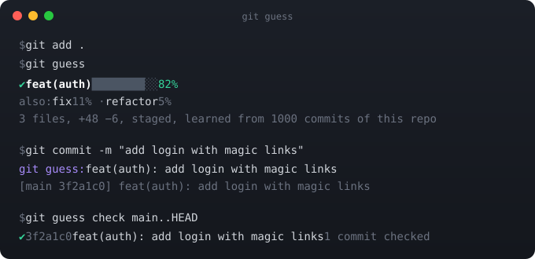

<p align="center">
  
</p>

<h1 align="center">git guess</h1>

<p align="center"><b>feat or fix? Let git guess.</b><br>
It reads the diff, learns how your repository names things, and writes the Conventional Commits type for you.<br>
One binary. No API key. Nothing leaves your machine. About 30 ms.</p>

<p align="center">
  <a href="https://github.com/Halleck45/git-guess/actions/workflows/ci.yml"></a>
  <a href="https://github.com/Halleck45/git-guess/releases"></a>
  <a href="https://github.com/marketplace/actions/git-guess"></a>
  <a href="LICENSE"></a>
</p>

---

Every team that adopts [Conventional Commits](https://www.conventionalcommits.org) hits the same wall: the format is easy, the *type* is not. Is this a `fix` or a `refactor`? Does a dependency bump count as `build` or `chore`? Everyone answers differently, linters only check the syntax, and the changelog ends up lying.

`git guess` answers from the one thing that never lies: the diff. It was trained on 488,000 commits from 244 open-source projects, and it keeps learning from the last 1,000 commits of *your* repository, so it picks up your conventions instead of imposing its own.

## Install

```sh
brew install Halleck45/tap/git-guess
```

```sh
curl -fsSL https://raw.githubusercontent.com/Halleck45/git-guess/main/install.sh | sh
```

```sh
npx git-guess                   # or: npm install -g git-guess
```

```sh
go install github.com/Halleck45/git-guess/cmd/git-guess@latest
```

Or grab the binary for Linux, macOS or Windows (amd64, arm64) from the [releases page](https://github.com/Halleck45/git-guess/releases) and put it on your `PATH`. It is called `git-guess`, which is why `git guess` just works.

## Sixty seconds

```sh
git guess                       # what are my staged changes?
git guess -m "add login"        # feat(auth): add login
git guess HEAD~1                # a commit, or a range such as main..feature
git guess --gitmoji -m "add login"   # ✨ (auth): add login
git guess eval                  # how well does it do on this repository's own history?
```

Then forget about it:

```sh
git guess hook install
```

From now on `git commit -m "add login"` becomes `feat(auth): add login`, a plain `git commit` opens your editor with the type prefilled, and when it is not sure it asks once, in one keystroke: `? fix 41% or refactor 38%? [f/r]`. The hook never blocks a commit.

## In CI

```yaml
- uses: Halleck45/git-guess@v1     # labels every pull request from its diff, lints its commits
```

## Learn more

- [Using git guess](docs/usage.md): every command, flag, exit code, the hook, JSON output, gitmoji
- [In CI](docs/ci.md): the GitHub Action, labeling, `git guess check`
- [How it learns your repository](docs/learning.md): the local index, `eval`, and how good it is (70% top-1, 88% top-2 on unseen repositories)
- [How it works](docs/how-it-works.md): the pipeline, and how to train your own model
- [FAQ](docs/faq.md): privacy, speed, Windows, and how it compares to commitizen, commitlint and AI commit writers

## License

MIT, see [LICENSE](LICENSE).
