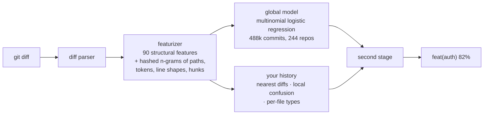

<p align="center">
  
</p>

<h1 align="center">git guess</h1>

<p align="center"><b>feat or fix? Let git guess.</b><br>
It reads the diff, learns how your repository names things, and writes the Conventional Commits type for you.<br>
One binary. No API key. Nothing leaves your machine. About 30 ms.</p>

<p align="center">
  <a href="https://github.com/Halleck45/git-guess/actions/workflows/ci.yml"></a>
  <a href="https://github.com/Halleck45/git-guess/releases"></a>
  <a href="https://github.com/marketplace/actions/git-guess"></a>
  <a href="LICENSE"></a>
</p>

---

Every team that adopts [Conventional Commits](https://www.conventionalcommits.org) hits the same wall: the format is easy, the *type* is not. Is this a `fix` or a `refactor`? Does a dependency bump count as `build` or `chore`? Everyone answers differently, linters only check the syntax, and the changelog ends up lying.

`git guess` answers from the one thing that never lies: the diff. It was trained on 488,000 commits from 244 open-source projects, and it keeps learning from the last 1,000 commits of *your* repository, so it picks up your conventions instead of imposing its own.

## Install

```sh
brew install Halleck45/tap/git-guess
```

```sh
curl -fsSL https://raw.githubusercontent.com/Halleck45/git-guess/main/install.sh | sh
```

```sh
go install github.com/Halleck45/git-guess/cmd/git-guess@latest
```

Prebuilt binaries for Linux, macOS and Windows (amd64, arm64) are on the [releases page](https://github.com/Halleck45/git-guess/releases). The binary is called `git-guess`, which is why `git guess` just works.

## Sixty seconds

```sh
git guess                       # what are my staged changes? (falls back to the working tree)
git guess -m "add login"        # feat(auth): add login
git guess HEAD~1                # a commit, or a range such as main..feature
git diff | git-guess            # any unified diff on stdin
git guess eval                  # how well does it do on this repository's own history?
```

When stdout is not a terminal, the output is exactly one line (the header), so it composes:

```sh
git commit -m "$(git guess -m 'add login')"
```

## Forget about it: the hook

```sh
git guess hook install
```

From now on, in this repository:

- `git commit -m "add login"` becomes `feat(auth): add login`
- a plain `git commit` opens your editor with `feat(auth): ` already on the first line, and the runner-up in a comment
- a subject that already has a type is left alone, and so are merge, squash, fixup, revert and amend messages
- when it is not sure, it asks once, in one keystroke:

```
? fix 41% or refactor 38%? [f/r, Enter keeps fix]
```

The hook never blocks a commit: if anything fails, your message goes through untouched. Skip it once with `GIT_GUESS_HOOK=0 git commit ...`, never be asked with `GIT_GUESS_ASK=0`, remove it with `git guess hook uninstall`. It respects `core.hooksPath`, so it lives happily next to husky or lefthook (add `git-guess hook run "$@"` to your existing `prepare-commit-msg`).

Prefer a wrapper to a hook? `git guess commit -m "add login"` runs `git commit -m "feat(auth): add login"` and passes every other argument through (`-a`, `-s`, `--amend`, `--no-verify`...).

## In CI: label pull requests, lint commit types

```yaml
# .github/workflows/git-guess.yml
on:
  pull_request:
permissions:
  contents: read
  pull-requests: write
jobs:
  guess:
    runs-on: ubuntu-latest
    steps:
      - uses: actions/checkout@v4
        with:
          fetch-depth: 0
      - uses: Halleck45/git-guess@v1
```

That is enough to get every pull request labeled `enhancement`, `bug`, `documentation`, and so on, from its diff. Options:

| input | default | what it does |
| --- | --- | --- |
| `label` | `true` | add a label with the guessed type |
| `label-map` | `feat=enhancement,fix=bug,docs=documentation` | rename types to your labels; other types keep their name |
| `label-prefix` | `""` | prefix for the remaining types, e.g. `type: ` |
| `min-confidence` | `0.5` | do not label below this confidence |
| `comment` | `false` | keep one sticky comment with the guess and its alternatives |
| `check-commits` | `true` | annotate commits without a type, or with a type the diff disputes |
| `strict` | `false` | fail the job on disputed types too |

Outputs `type`, `scope`, `confidence` and `header` are available to later steps, for example to prefix the PR title or pick a release channel.

Behind the action is `git guess check`, a semantic linter you can run anywhere:

```
$ git guess check main..HEAD
  ✔ 3f2a1c0 fix(router): keep query on redirect
  ✘ 9b8e7d6 add retry option
      no type; suggestion: feat: add retry option
  ? 1c2d3e4 docs: handle null token
      declared docs but the diff looks like fix 91%

3 commits checked, 1 without type, 1 disputed
```

Unlike commitlint, it reads the diff. Exit code 1 when a commit has no type, `--strict` to fail on disputed ones too, `--github` for workflow annotations, `--json` for everything else. Without a range it checks the current branch against its upstream.

## It learns your repository

The first time it runs in a repository, `git guess` indexes the last 1,000 conventional commits (a second or two, once; the index lives in `.git/git-guess/` and is refreshed incrementally). Every guess then weighs the global model against three local pieces of evidence:

- the types of the past diffs most similar to yours,
- what this repository tends to call what the global model guesses (a project that says `chore` for CI changes gets `chore`),
- the types of past commits that touched the same files.

You can watch it work:

```
$ git guess eval
replayed 250 commits of this repository, each scored with only the commits before it
  top-1 79%   top-2 90%   (global model alone: 78%)

  chore      147/159  █████████░  guessed as fix 6, docs 5
  fix         18/24   ████████░░  guessed as chore 3, feat 3
  docs        16/18   █████████░  guessed as chore 2
  ...
```

`eval` replays your history in order, guessing each commit from the ones before it, and compares with what the author chose. Run it before installing the hook: it tells you exactly what to expect on your project.

`--explain` shows the closest past commits and the features that drove a decision; `--no-prior` turns the local learning off. Diffs read from stdin are never adapted.

## How good is it, honestly

Measured on 36 repositories the model had never seen (77,000 commits, split by repository, not by commit), scoring each commit with only the commits before it:

| Setting | Top-1 | Top-2 |
| --- | --- | --- |
| Diff only, no history (stdin, brand-new repository) | 59% | 79% |
| Diff + your repository's history (the default) | **70%** | **88%** |

Probabilities are calibrated: above 90% confidence it is right 96% of the time; below 50% about 44%, which is why it asks instead of guessing silently.

The remaining errors are almost all `feat` against `fix` against `refactor`, and `chore` against everything. That is not a modelling gap: the same three-line patch is a fix for one author and a refactor for another, and the diff does not carry intent. The easy types are where it shines (docs 86% recall, test 77%, ci 66% before local learning, higher after). Different projects label the same change differently, which is exactly why it reads your history.

## How it works



- **Parser and featurizer** are pure Go and shared between training and inference, so what the model learned is exactly what it sees.
- **Global model**: weights pruned, quantized to int16 (3.8 MB) and temperature-calibrated on held-out repositories.
- **Second stage**: a 47-weight model trained on chronological replays of every training repository, so it knows how much to trust your history versus the global model at any history size.
- **Scope** is guessed from monorepo layouts (`packages/*`, `apps/*`, `crates/*`, `internal/*`...) and from the scopes already used in your log. `--scope api` forces one, `--no-scope` removes it.

No network, no telemetry, no model download: everything is embedded in a 7 MB binary.

## Compared to

| | git guess | commitizen / cz | commitlint | AI commit writers |
| --- | --- | --- | --- | --- |
| picks the type for you | from the diff | you pick from a menu | no, checks syntax only | from the diff, via an LLM |
| learns your repository | yes | no | no | no |
| offline, no API key | yes | yes | yes | no |
| latency | ~30 ms | interactive | ~200 ms (node) | seconds, costs money |
| lints existing commits | semantically | no | syntactically | no |
| labels pull requests | yes | no | no | no |

They compose: commitizen for the interactive flow, commitlint for enforcement, `git guess` to fill in the type.

## FAQ

**Does it send my code anywhere?** No. There is no network code in the binary.

**Does it slow down `git commit`?** About 30 ms once the history is indexed, a second or two on the very first run in a repository.

**My repository does not use Conventional Commits yet.** Then there is no history to learn from and you get the global model (59% top-1, 79% top-2). Accuracy climbs as your history grows; `git guess eval` shows where you stand.

**Windows?** Yes, the hook runs under Git for Windows' shell. The interactive question needs a terminal and is skipped in editors and CI.

**Can I disable the question, the scope, the local learning?** `GIT_GUESS_ASK=0`, `--no-scope`, `--no-prior`.

**Exit codes?** `0` ok, `1` error (no changes, not a diff, git failure), `3` confidence below `--min-confidence`. `git guess --min-confidence 0.6 -q || echo "pick it yourself"`.

**Machine readable?** `--json` gives `type`, `scope`, `confidence`, `header`, `candidates`, `source`, `files`, `added`, `removed`, `adapted_to_repo`, `history_commits` and, with `--explain`, `nearest` and the driving features.

## Train your own

```sh
python3 scripts/collect.py                  # probe and clone repositories, extract (diff, type) pairs into data/raw
make featurize                              # featurize with the exact code used at inference
make train                                  # train, calibrate, quantize, export internal/model/model.bin
make train-meta                             # replay every repository, train and export the second stage
make build                                  # both models are embedded
```

`scripts/repos.txt` is the seed list. Pull requests adding repositories from under-represented ecosystems are the most valuable contribution you can make.

## License

MIT, see [LICENSE](LICENSE).
