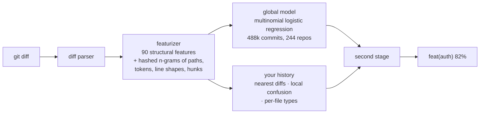

# How git guess works

## Pipeline



- **Parser and featurizer** are pure Go and shared between training and inference, so what the model learned is exactly what it sees.
- **Global model**: weights pruned, quantized to int16 (3.8 MB) and temperature-calibrated on held-out repositories.
- **Second stage**: a 47-weight model trained on chronological replays of every training repository, so it knows how much to trust your history versus the global model at any history size.
- **Scope** is guessed from monorepo layouts (`packages/*`, `apps/*`, `crates/*`, `internal/*`...) and from the scopes already used in your log. `--scope api` forces one, `--no-scope` removes it.

No network, no telemetry, no model download: everything is embedded in a 7 MB binary.


## Training your own

```sh
python3 scripts/collect.py                  # probe and clone repositories, extract (diff, type) pairs into data/raw
make featurize                              # featurize with the exact code used at inference
make train                                  # train, calibrate, quantize, export internal/model/model.bin
make train-meta                             # replay every repository, train and export the second stage
make build                                  # both models are embedded
```

`scripts/repos.txt` is the seed list. Pull requests adding repositories from under-represented ecosystems are the most valuable contribution you can make.
